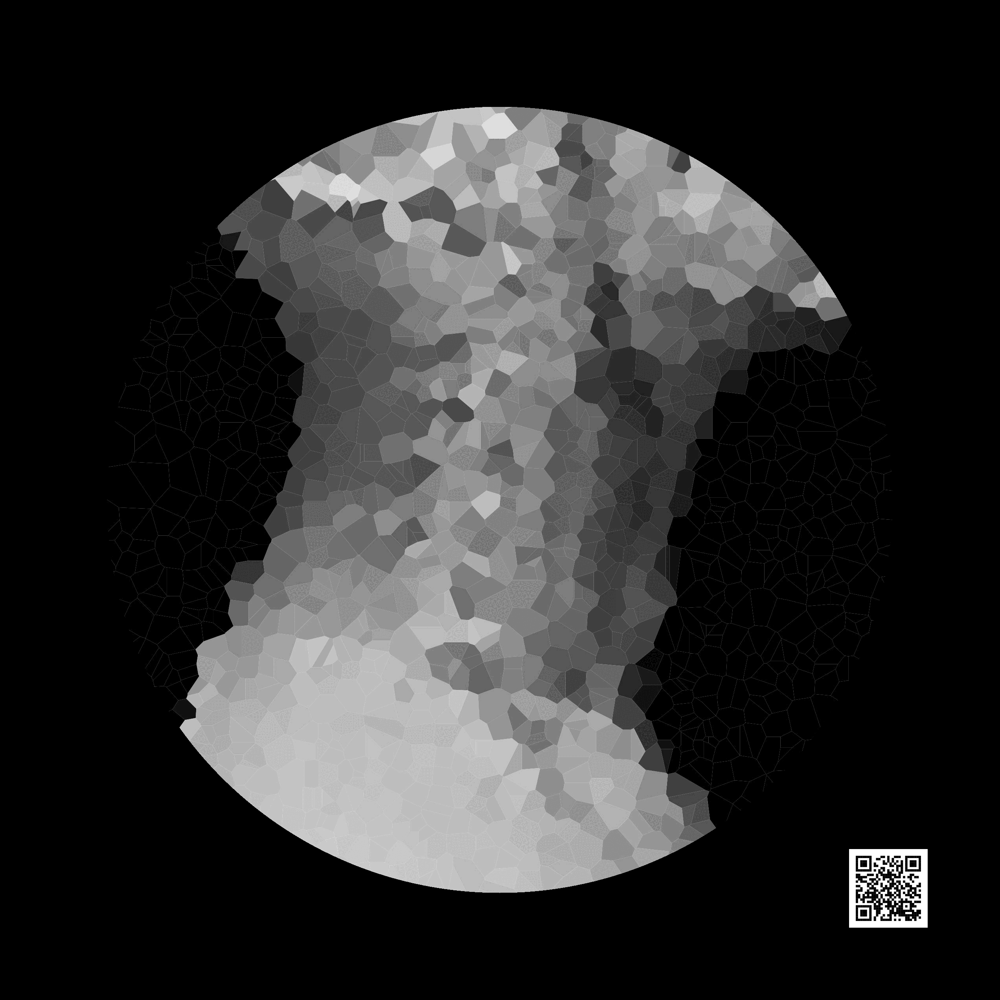

# Feeder Main

Rodrigo Dal Ben, 2025-01-20

## News! 

This piece is/was part of the "Innovative Impressions: The Fusion of Art and Science" exhibition at the [McCaig Institute](https://mccaig.ucalgary.ca/) Arts Gallery by the [ARTSSociety](https://artssocietyucalgary.ca/). 
Preparing for the exhibition was fun! Carina Oedingen and Ana Fuhrmann, from the [Marshall Health Economics Team](https://cumming.ucalgary.ca/research/health-economics/home#:~:text=Deborah%20Marshall%20and%20her%20team,patient%20engagement%20and%20patient%20centeredness.), 
contributed with design ideas and Carina, acting as my art manager (!), got a brand new frame from an anonymous benefactor.
New ideas for future work are already flourishing, some of them involving Ana's own spinal X-rays :)

## An adventure in Generative Art

### Inspiration
In 2024, a huge puddle showed up at a Calgary intersection. A few hours later, the city found out that [Calgary's Bearspaw South Feeder Main had a major water leak](https://globalnews.ca/news/10626802/calgary-feeder-main-break-ballpark-cost/). 
After digging into it, they discovered the leak happened because of [lots of small changes to the feeder’s structure over a long time](https://www.cbc.ca/news/canada/calgary/calgary-bearspaw-south-feeder-main-preliminary-findings-1.7385334#:~:text=Built%20in%201975%2C%20the%20feeder,the%20city's%20treated%20water%20supply.). 
While trying to save water and wondering if this was a sneak peek at an apocalyptic future, I couldn’t help but think of the parallel with our own "feeder main"—the spinal cord. 
We rely on it so much, but we don’t take care of it the way we should. And just like the water main, small changes over time can lead to big problems for our overall health.

### Motivation
A series of [blog posts by Nicola Rennie](https://nrennie.rbind.io/blog/getting-started-generative-art/) and the [workshop materials from Daniele Navarro](https://art-from-code.netlify.app/) got me wondering if someone like me—a mere mortal—could turn data frames into art. 
Inspired by this [hands-on, step-by-step tutorial by Michael Freeman](http://mfviz.com/r-image-art/), I decided to create a [Voronoi diagram](https://en.wikipedia.org/wiki/Voronoi_diagram), a type of tessellation, based on our feeder main.

Using a [lateral X-ray of the neck with a cervical collar in a patient with cervical spine trauma by Nevit Dilmen, CC-BY-SA 3.0](https://commons.wikimedia.org/wiki/File:Medical_X-Ray_imaging_RAH06_nevit.jpg) as a starting point, 
I turned to some amazing R packages—[ggvoronoi](https://github.com/garretrc/ggvoronoi), [cropcircles](https://github.com/doehm/cropcircles), [imager](https://asgr.github.io/imager/), and [magick](https://docs.ropensci.org/magick/articles/intro.html#read-and-write)—to bring the idea to life.

And guess what? The dream came true!  

I hope you enjoy the art piece, and I encourage you to use the open-source code included with it to embark on your own adventures in generative art.

***

## Folder structure

`script`: R function, `fnc_voronoi.R`, that starts with an input image and create a Voronoi tessellation. Users can set the number of polygons in each image, size in pixels, dimensions for printing etc.

`input` 

  Contains all relevant images that set the starting point for the `fnc_voronoi.R`. 

  1. `00`: Original image (`.jpg`)
  2. `01`: Cropped images into a square (`.jpg`)
  3. `02`: Square image with removed background and resize to 500x500 pixels (`.png`)
  4. `03`: Square image with solid, black, background (`.jpg`)
  5. `qr_code`: QR code with signature, generated by the R code (`.svg`)

`process`

  Contains all intermediate steps created with `fnc_voronoi.R`. 
  
`output`

  Contains all final products created with `fnc_voronoi.R`: individual images, a gif (if more than one image was generated), and a sub folder with PDFs for printing.

### License

**CC-BY-SA 4.0** (see `license.md`)
